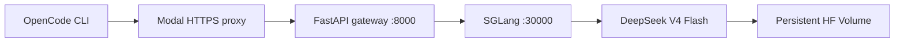

# Architecture

```mermaid
flowchart LR
  O[OpenCode CLI] --> M[Modal HTTPS proxy]
  M --> G[FastAPI gateway :8000]
  G --> S[SGLang :30000]
  S --> D[DeepSeek V4 Flash]
  D --> V[Persistent HF Volume]
```

The gateway authenticates the external bearer token while SGLang listens only on localhost.
